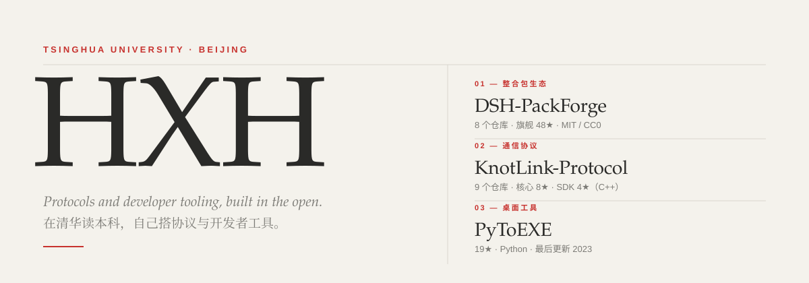
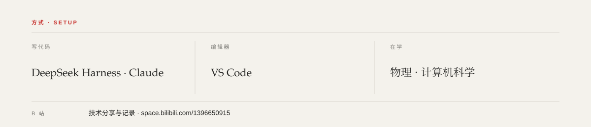
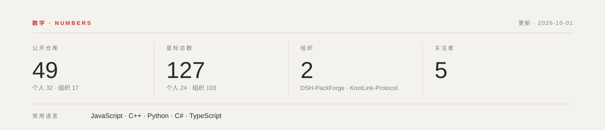

  <picture>
    <source media="(prefers-color-scheme: dark)" srcset="assets/masthead-dark.svg">
    
  </picture>

---

### 关于 · About

在清华读本科，方向是人工智能，同时在补物理和计算机科学的底子。

我的项目大多不在这个账号上，而在两个自己建的组织里 —— [DSH-PackForge](https://github.com/DSH-PackForge) 和 [KnotLink-Protocol](https://github.com/KnotLink-Protocol)。个人账号下星最多的是 [PyToEXE](https://github.com/hxh230802/PyToEXE)。

---

### 作品选 · Selected

<!-- SELECTED:START -->
**01 — [DSH-PackForge](https://github.com/DSH-PackForge)** · 组织 · 8 个仓库

*DeepSeek Harness 的整合包与插件生态。*

[DSH-PackForge](https://github.com/DSH-PackForge/DSH-PackForge) 48★ · [dsh-pack-plugin](https://github.com/DSH-PackForge/dsh-pack-plugin) 16★ · [dsh-packforge-app](https://github.com/DSH-PackForge/dsh-packforge-app) 15★ · [dsh-pack-market](https://github.com/DSH-PackForge/dsh-pack-market) 9★

**02 — [KnotLink-Protocol](https://github.com/KnotLink-Protocol)** · 组织 · 9 个仓库

*一套让程序之间互相通信的协议。*

[KnotLink](https://github.com/KnotLink-Protocol/KnotLink) 8★ · [KnotLinkSDK](https://github.com/KnotLink-Protocol/KnotLinkSDK) 4★

**03 — [PyToEXE](https://github.com/hxh230802/PyToEXE)** · 仓库 · 19★ · Python · 2023

*一个可以把 Python 文件转换成 exe 程序的工具。*

个人账号里星数最多的仓库；2023 年之后没有再更新。

个人账号下另有 31 个公开仓库 —— [全部仓库 →](https://github.com/hxh230802?tab=repositories)
<!-- SELECTED:END -->

---

### 方式 · Setup

  <picture>
    <source media="(prefers-color-scheme: dark)" srcset="assets/setup-dark.svg">
    
  </picture>

---

### 数字 · Numbers

  <picture>
    <source media="(prefers-color-scheme: dark)" srcset="assets/stats-dark.svg">
    
  </picture>

---

### 联系 · Elsewhere

**hxh26@tsinghua.edu.cn** · [Bilibili](https://space.bilibili.com/1396650915) · [全部仓库](https://github.com/hxh230802?tab=repositories)

<!-- 占位：以下链接等你确认后替换 -->
[个人博客](https://example.com) · [知乎](https://example.com) · [X](https://example.com)

<!--
维护说明（不会显示在主页上）

  下面这些都由 .github/workflows/assets.yml 每天自动重写，不要手改：

    assets/masthead-{light,dark}.svg     刊头里的仓库数与星数
    assets/stats-{light,dark}.svg        数字卡片
    README.md 中 SELECTED:START 与 SELECTED:END 之间的整段

  想改文案 → scripts/build_assets.py 顶部的 FEATURED。
  想改版式 → 同一个文件里的版式常量与 render_* 函数。

  assets/setup-{light,dark}.svg 没有动态数据，是手写的，脚本不碰它。

  组织成员身份是私有的，/users/hxh230802/orgs 返回空数组，所以组织名单写死在
  scripts/build_assets.py 的 ORGS 里。平台数口径：公开仓库数含 fork（就是个公开
  仓库），星标数与语言分布不含 fork（fork 的星属于上游）。

  各  的 alt 刻意不写具体数字：alt 不在标记区内，Action 不会更新它，
  写死了就会和卡片对不上（无障碍描述用文字本来也更合适）。
-->
