  <picture>
    <source media="(prefers-color-scheme: dark)" srcset="assets/panel-dark.svg">
    
  </picture>

<!-- LINKS:START -->
`01` [DSH-PackForge](https://github.com/DSH-PackForge) · [dsh-pack-plugin](https://github.com/DSH-PackForge/dsh-pack-plugin) · [dsh-packforge-app](https://github.com/DSH-PackForge/dsh-packforge-app) · [dsh-pack-market](https://github.com/DSH-PackForge/dsh-pack-market)

`02` [KnotLink-Protocol](https://github.com/KnotLink-Protocol) · [KnotLink](https://github.com/KnotLink-Protocol/KnotLink) · [KnotLinkSDK](https://github.com/KnotLink-Protocol/KnotLinkSDK)

`03` [PyToEXE](https://github.com/hxh230802/PyToEXE)

`00` [hxh230802 的全部仓库](https://github.com/hxh230802?tab=repositories)

`联系` **hxh26@tsinghua.edu.cn** · [Bilibili](https://space.bilibili.com/1396650915) · [个人博客](https://example.com) · [知乎](https://example.com) · [X](https://example.com)
<!-- LINKS:END -->

<!--
维护说明（不会显示在主页上）

  主页是一整块 SVG 面板（assets/panel-{light,dark}.svg），由
  scripts/build_panel.py 从公开的 GitHub API 生成，
  .github/workflows/assets.yml 每天跑一次并自动提交。

  为什么 Markdown 里只剩链接：SVG 是被 GitHub 当成  载入的，
  图里的 <a> 点不动 —— 所以所有可点的东西必须留在 Markdown。
  链接索引会随仓库星数变化自动重排，同样不要手改。

  想改文案 → scripts/build_panel.py 顶部的 ABOUT_LINES / SETUP / FEATURED。
  想改版式 → 同一个文件里的版式常量与 block_* 函数。
  画布高度由内容算出来，不会溢出；宽度越界会在日志里打 OVERFLOW 警告。

  组织成员身份是私有的，/users/hxh230802/orgs 返回空数组，所以组织名单写死在
  scripts/build_panel.py 的 ORGS 里。统计口径：公开仓库数含 fork（本身就是公开
  仓库），星标数与语言分布不含 fork（fork 的星属于上游）。

  各  的 alt 刻意不写具体数字：alt 不在标记区内，Action 不会更新它，
  写死了就会和面板对不上。
-->
